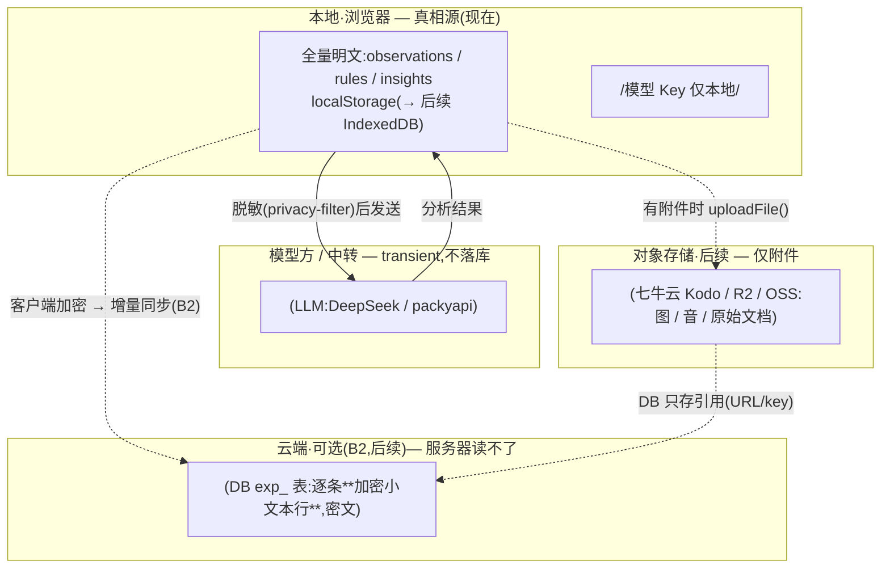

# 数据与隐私存储模型

> 日期:2026-06-22 · 关联:`../backend-roadmap.md`(B2/隐私层)、`architecture-design.md`(本地优先原则)。
> **当前阶段:全本地处理。云端 / 对象存储均为后续(按触发引入)。**

## 原则

- **本地优先**:本地是**全量明文真相源**;云端是可选层,不是默认。
- **数据归你**:经验库含情绪/决策/财务等私密内容,默认不出本机。
- **Key 不上云**:模型 Key 只在浏览器本地(`.env.local` / localStorage)。
- **进模型前脱敏**:发给模型的文本先剥 PII/密钥(privacy-filter)。
- **完整 ≠ 可读**:云端能存**完整**备份,但以**密文**形式——服务器读不了。

## 数据流(各环节存什么)

## 各环节明细

| 环节 | 存什么 | 谁能读 | 状态 |
|------|--------|--------|------|
| **本地**(localStorage/IndexedDB) | **全量明文**(真相源) | 仅本人设备 | ✅ 现在 |
| **给模型** | **脱敏文本**(privacy-filter 剥 PII/密钥) | 模型方临时处理,**不保存** | ✅ 直连;脱敏待移植 |
| **云端备份/同步**(B2) | **逐条加密的小文本行**(密文) | 服务器**读不了**(端到端) | ⬜ 后续 |
| **对象存储**(附件) | 图/音/原始文档等**文件** | 按需 | ⬜ 后续 |

## 关键决策(本次理清)

1. **云端备份是可能的,但服务器读不了**:存**客户端加密后的密文**,不是脱敏(会丢内容)、也不是明文(隐私倒退)。完整 + 私密 = "加密保险箱"。
2. **不把整库打成一个大 blob**:那像"存文件"、每次全量上传。改为**逐条加密成小文本行**(`exp_` 表正常结构,敏感字段/整条 JSON 加密)——DB 原生处理,还支持**增量同步**。
3. **DB 不存大文件,但我们也没有大文件**:纯文本经验是小文本行,**不需要对象存储/中转**;只有**附件(图/音/原始文档)**才上对象存储(七牛云 Kodo / R2 / OSS),**藏在 `uploadFile()` 接口后,provider 可换**,DB 只存引用。
4. **二选一(物理约束)**:要么"完整 + 私密"(加密,服务器只当保险箱、不能在上面做事);要么"服务器可处理/查询"(明文/脱敏,放弃部分私密)。本产品选**前者**。

## 当前阶段(明确)

> **现在 = 全本地**:md 导入是 `FileReader` 本地读 → 解析 → 提炼 → 存 localStorage,**原始文件读完即弃**(不存)。**不接云、不接对象存储、不做同步。**
> 云端加密同步(B2)、对象存储附件,都等**触发信号**(多端/备份、出现附件)再做——见 `../backend-roadmap.md`。

## 触发与候选

| 后续能力 | 触发 | 候选方案 |
|----------|------|----------|
| 进模型脱敏(前端) | 隐私加固(随时可做,纯前端) | 移植 privacy-filter 正则/熵子集到 TS |
| 云端加密同步 | 多端 / 备份 | `exp_` 表逐条密文行 + 增量 upsert(B2) |
| 附件存储 | 出现图/音/原始文档 | 七牛云 Kodo / Cloudflare R2 / 阿里 OSS(`uploadFile()` 可换) |

---

> 一句话:**本地明文(主)→ 模型只收脱敏 → 云端(后续)存逐条加密小文本行(服务器读不了,无需中转)→ 附件(后续)才上对象存储 + DB 存引用。当前只做本地,其余按触发再说。**
