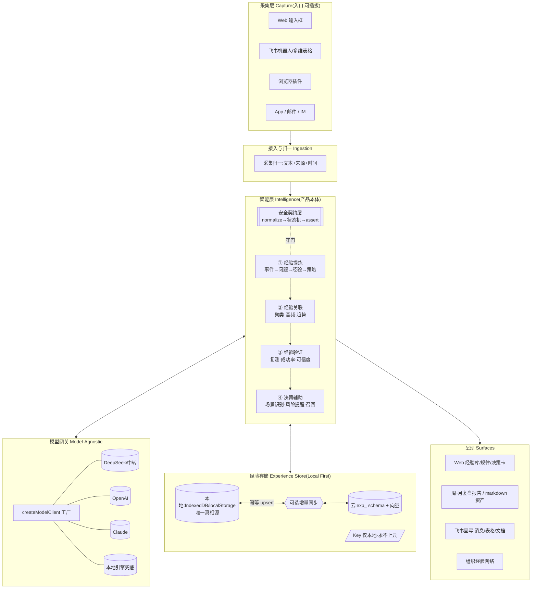

# 目标架构蓝图(Target Architecture Blueprint)

> **终局形态**——系统完全展开后的样子(跨越 V1–V5)。
> 配套:原则边界见 `architecture-design.md`;现状见 `current-architecture.md`;演进节奏见 `../version-roadmap.md`;债务清理见 `refactor-plan.md`。
> 注:这是**北极星蓝图**,非当前实现;当前仅落地其中一部分(见 §7)。

## 北极星

> **把任意来源的碎片经历,变成可复用、可验证、能在未来主动提醒你的决策资产。**

---

## 1. 全景图



---

## 2. 智能层终局:四能力管线

| 能力 | 终局职责 | 关键机制 |
|------|----------|----------|
| ① 提炼 | 口语化输入 → 结构化经验(事件/问题/经验/策略/标签) | Prompt-1 + **契约状态机**(strategy/caution/watch 三态)+ 本地兜底 |
| ② 关联 | 跨记录聚类、高频问题/成功模式、时间趋势 | 统计聚类(可靠基座)+ 模型归因(达标簇)+ 最小样本门槛 |
| ③ 验证 | 经验从"观点"→"经验证策略":验证次数/成功率/可信度/演化 | 复用 `evaluationEngine` 作可信度后端,接 Insight 与规则 |
| ④ 决策辅助 | 新场景主动召回历史经验、风险提醒、决策建议 | 相似召回(关键词→向量)+ 阈值/可忽略 + 风险规则 |

**贯穿铁律**:任何模型/本地输出**必经契约层**(`normalize → enforce 状态机 → assert`),失败统一降级;**绕过契约写库 = 架构违规**。

## 3. 采集层终局(可插拔入口)

- 多通道:Web / 飞书机器人 / 飞书多维表格 / 浏览器插件 / 邮件 / IM。
- 所有通道 → **统一归一(文本+来源+时间)** → 汇入**同一条** `analyzeObservationResilient` 管线。
- **飞书是入口不是产品**:它解决"采集成本趋近 0 / 持续记录",智能层才是护城河。
- 回写:飞书消息确认、多维表格行、文档周报——采集与回写对称,但都不含业务规则。

## 4. 数据架构终局(Local First + 可选云同步)

- **本地为主**:IndexedDB(大容量、索引、事务)作唯一运行时真相源;离线可用。
- **云为可选同步**:`exp_` schema 双端**同构**;客户端生成 id → **幂等 upsert**;`created_at/updated_at` 支撑增量;冲突走 merge(已有导入合并逻辑可复用)。
- **向量**:`exp_rules.embedding` 支撑 V4 相似召回(本地向量检索)。
- **敏感分层**:模型配置/Key **仅本地**(`exp_model_configs` 云端只存非敏感 + 引用);演示模型产物纯本地。
- **schema 版本化** + 迁移钩子(见 refactor R6)。

## 5. 目标代码结构(拆分后的终局)

```text
src/
├── types/                  # 领域类型(按子域可拆:experience / insight / evaluation)
├── config/                 # 阈值/魔数/标签映射集中(R7/R8)
├── services/
│   ├── capture/            # 各采集通道归一(web/feishu/…)
│   ├── model/              # ObservationModelClient + createModelClient(多厂商)+ modelConfig
│   ├── intelligence/
│   │   ├── extraction/     # 提炼(contract + prompts + 本地引擎兜底)
│   │   ├── clustering/     # 关联/规律发现(patternDiscovery)
│   │   ├── validation/     # 验证(evaluationEngine 重组为可信度后端)
│   │   └── decision/       # 决策辅助(decisionHints + 风险召回)
│   ├── export/             # markdown/JSON 资产导出(纯函数)
│   └── persistence/        # 本地存储读写归一 + 迁移 + (可选)云同步
├── stores/                 # 按子域拆:rules / insights / evaluations / session
└── pages/ + components/    # 视图与 DOM 副作用;面板/卡片组件化(R1)
```

对照现状:`stores/experience.ts`(2847)、`pages/index/index.vue`(3595)将按上表**拆解**(refactor R1/R2);`evaluationEngine` 收敛为 `intelligence/validation`(R3)。

## 6. 横切关注点

- **Model-Agnostic**:厂商差异只在 `services/model`;业务层只认 `ObservationModelClient`。
- **安全**:Key 仅本地;契约层防注入/防幻觉成规律;秘密文件全 gitignore(ADR-007)。
- **可观测/降级**:模型失败→本地兜底 + 对用户可见的错误提示。
- **可测试**:`services/` 纯函数为主,`node:assert` 套件;UI 靠 typecheck + build + 走查。

## 7. 演进路径(Current → Target)

| 层 | 当前(As-Is) | 目标(Blueprint) | 节奏 |
|----|------|------|------|
| 采集 | Web 输入 + 批量导入 | 多通道(飞书/插件/…) | V5 |
| 提炼 | ✅ 真模型 + 三态契约 + 本地兜底 | 同(稳态) | V1 ✅ |
| 关联 | ✅ 统计聚类 + 模型归因(基础) | + 受控根因标签/更稳聚类 | V2 / R5 |
| 验证 | 🟡 引擎存在但折叠 | 重组为可信度后端,接 Insight | V3 / R3 |
| 决策 | 🟡 关键词召回提醒 | 向量召回 + 风险规则 | V4 |
| 存储 | localStorage 单源 | IndexedDB + 可选云同步 + 向量 | 后置 / R6 |
| 模型 | DeepSeek 内置 + 自配 | 多厂商网关 | V2 技术线 |
| 代码 | 巨石 store/index.vue | 子域拆分(§5) | R1/R2 |

> **当前比赛切片**只覆盖上表的 V1+V2 主体(提炼+关联)+ V4 基础;其余是蓝图方向,按版本推进。
