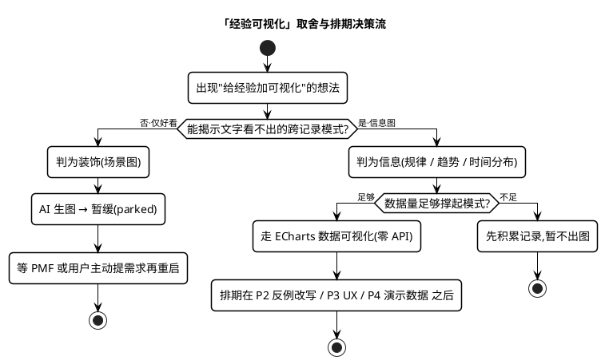
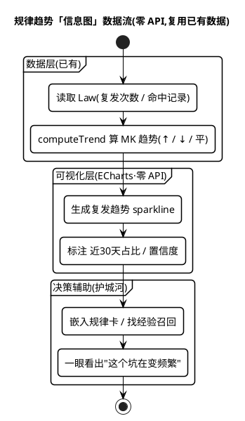

# V6 经验可视化 —— 设计文档

> **状态:** 🟡 已评估 · **AI 生图暂缓(parked)**;替代方向 = 规律趋势数据可视化(见 §9)
> 日期:2026-06-25
> 关联:`docs/version-roadmap.md`、`src/types/experience.ts`、`src/services/modelClient.ts`
>
> **版本变更(2026-06-25):** 本特性原误标为 V5。`docs/version-roadmap.md` 中 **V5 已占用 = 组织经验 / 飞书生态接入**(已出可行性报告、维持推迟)。经验可视化属"记忆锚点 / 分享传播"的体验增强,**不在 智能层(提炼→关联→验证→决策辅助)护城河主线上**,故改列为 **V6 实验特性**,优先级低于飞书与决策主线,有明确用户诉求再排期。

---

## 1. 背景与定位

当前 Experience OS 以**文字为主**呈现经验资产：规则卡片、规律库、决策建议均为文本形式。虽然信息完整，但存在两个痛点：

1. **信息密度低**：长文本策略卡片在移动端阅读体验不佳
2. **记忆锚点弱**：纯文字难以快速建立视觉记忆，规律难以"一眼识别"

V6 的目标：**让经验"看得见"**——通过 AI 生成图片，为每条经验规则/规律创建可视化卡片，提升信息密度和记忆效率。

### 核心价值

| 维度 | 当前状态 | V6 目标 |
|------|---------|--------|
| **信息密度** | 文字描述，需逐行阅读 | 图片+文字，一眼获取核心 |
| **记忆效率** | 文字记忆，易遗忘 | 视觉记忆，更持久 |
| **分享传播** | 纯文字分享，吸引力弱 | 图片卡片分享，易传播 |
| **情感连接** | 理性、数据驱动 | 理性+感性，增强共鸣 |

---

## 2. 范围与非目标

**做:**
- 为 `ExperienceRule` 生成可视化图片
- 为 `Law`（规律）生成可视化图片
- 支持多种图片风格（插画、照片、极简等）
- 手动触发 + 智能推荐生成时机
- 图片缓存与持久化

**非目标(本期坚决不做):**
- ❌ 视频/动图生成 —— 成本高、加载慢，非本期重点
- ❌ 自定义绘制功能 —— 超出"自动可视化"范围
- ❌ 图片编辑/修图工具 —— 非核心需求
- ❌ 团队协作中的图片评论 —— 留 V6

**红线(继承 CLAUDE.md):**
- **本地优先**: 图片数据存 localStorage；模型不可用时**降级**为默认图标
- **API Key 本地存储**: 生图 API Key 不提交、不上云
- **隐私保护**: 生成图片时避免包含敏感信息（姓名、手机号等）
- **成本可控**: 默认手动触发，避免自动生成产生意外费用

---

## 3. 数据模型

### 3.1 新增类型

在 `src/types/experience.ts` 中新增：

```ts
export type ImageStyle = 'illustration' | 'photography' | 'minimalist' | 'infographic'

export type ImageGenerationStatus = 'none' | 'generating' | 'success' | 'failed'

// 注意:轻量元数据随主实体进 localStorage;图片字节本身不进这里(见 3.3)。
export interface ExperienceImage {
  id: string                      // 同时作为 IndexedDB blob 的主键
  prompt: string
  style: ImageStyle
  status: ImageGenerationStatus
  channel: string                 // 生成所用的渠道标识(用户自配,见 4.4),仅作记录
  createdAt: string
  // ❌ 不存 url、不存 base64 —— 现代生图模型返回的是图片字节而非托管 URL,
  //    且字节体积大(~0.5–2MB/张),直接进 localStorage 会撑爆配额并连累主状态持久化。
}
```

### 3.2 扩展现有类型

```ts
export interface ExperienceRule {
  // ... 现有字段
  image?: ExperienceImage
}

export interface Law {
  // ... 现有字段
  image?: ExperienceImage
}
```

### 3.3 持久化(两层:元数据 localStorage / 字节 IndexedDB)

现代生图模型(用户自配渠道,见 4.4)返回的是**图片字节(base64 / inline data),不是托管 URL**,因此持久化必须分层:

- **元数据层(localStorage)**:`image: ExperienceImage`(轻量,无字节)作为 `ExperienceRule` / `Law` 的可选属性,随主实体一起存。`PersistedState` 无需额外字段。
- **字节层(IndexedDB)**:图片 `Blob` 单独存 IndexedDB,key = `image.id`。容量级别为数百 MB,且原生支持 Blob。展示时用 `URL.createObjectURL(blob)` 生成临时对象 URL,组件卸载时 `revokeObjectURL` 释放。
- **配额护栏(LRU)**:设图片张数/总字节上限(如 ≤ N 张),超限按"最久未访问"淘汰 IndexedDB 记录,并将对应 `image.status` 重置为 `none`(元数据保留 prompt,可一键重生)。

> **为什么不用 localStorage 存字节**:localStorage 总配额约 5MB,几张 base64 图即溢出,且溢出会导致 `persist()` 抛错、**连累规则/观察等核心数据存不进去**。这是拿装饰功能赌主数据安全,坚决避免。

---

## 4. 技术架构

### 4.1 架构分层

```
types/ → services/imageGeneration.ts → stores/experience.ts → components/
```

### 4.2 服务层设计

新增 `src/services/imageGeneration.ts`：

#### 4.2.1 生图客户端接口

```ts
export interface ImageModelClient {
  generateImage(input: {
    prompt: string
    style?: ImageStyle
    size?: string
  }): Promise<{ blob: Blob }>   // 返回图片字节(由各渠道 adapter 把 base64/inline data 转成 Blob)
}
```

渠道无关:每个生图渠道实现一个 adapter,把其返回(多为 base64 / inline image data)统一转成 `Blob` 交给上层。上层只认 `Blob`,不关心具体模型。

#### 4.2.2 提示词构建器

根据经验的类别、方向、主题自动构建高质量提示词：

| 类别 | 基础提示词模板 |
|------|--------------|
| 运动 | `A serene gym scene with modern equipment, soft lighting, professional photography style` |
| 饮食 | `Appetizing food photography, fresh ingredients, warm lighting, culinary style` |
| 出行 | `Clean street map illustration, navigation arrows, minimalist design` |
| 工作 | `Productive workspace, clean desk, modern office, soft natural light` |
| 购物 | `Empty supermarket aisle, clean shelves, bright lighting, retail photography` |
| 学习成长 | `Cozy study corner, books, warm lighting, peaceful atmosphere` |
| 理财 | `Financial charts, clean data visualization, professional infographic` |
| 生活 | `Cozy home interior, warm lighting, comfortable atmosphere` |
| 偏好 | `Personal preference concept, abstract visualization, modern design` |
| 其他 | `Abstract concept visualization, modern design, clean composition` |

> **避免"通用壁纸"**:上表只是**按类别的底图**。若仅按 category 出图,同类所有规则共享一张图 → 是装饰而非信息,和"信息密度/一眼获取核心"的目标相悖。实际 prompt 必须**叠加这条经验的具体语义**:主题词(title/conclusion 提取的关键短语)、方向(正向=明亮/有序,负向避坑=克制/警示色调)、关键条件(时间/地点/对象)。即 `最终 prompt = 类别底图 + 具体经验语义 + 风格映射(4.2.3)`,让同类不同经验的图也能区分。脱敏后再拼(见安全验收 2)。

#### 4.2.3 风格映射

```ts
const stylePrompts: Record<ImageStyle, string> = {
  illustration: 'flat illustration style, vector art, clean lines, vibrant colors',
  photography: 'professional photography, high quality, realistic, detailed',
  minimalist: 'minimalist design, clean composition, white space, modern aesthetic',
  infographic: 'infographic style, data visualization, icons, charts, clean layout',
}
```

### 4.3 Store 集成

在 `src/stores/experience.ts` 中新增：

- `generateRuleImage(ruleId: string, style?: ImageStyle)` —— 为规则生成图片(写元数据 + 字节落 IndexedDB)
- `generateLawImage(lawId: string, style?: ImageStyle)` —— 为规律生成图片(同上)
- `clearRuleImage(ruleId: string)` —— 清除规则图片(删 IndexedDB 字节 + 重置元数据)
- `clearLawImage(lawId: string)` —— 清除规律图片(同上)

> 字节读写封装在独立的 `src/services/imageStore.ts`(IndexedDB 封装:`put/get/delete/evictLRU`),store action 不直接碰 IndexedDB,保持 services→stores 单向依赖。

### 4.4 生图渠道(用户自配、可插拔)

生图渠道由**用户自行接入**,与文本模型解耦。配置独立于文本模型,存浏览器本地 `localStorage` key = `experience-os:image-model`(形如 `{ channel, apiKey, model, baseUrl }`),**与文本模型的 `experience-os:model` 分开**——两者能力与计费互不相干。

- **接入方式**:每个渠道写一个 `ImageModelClient` adapter(把渠道返回的 base64/inline data 转成 `Blob`,见 4.2.1)。候选渠道由用户决定(如 OpenAI 兼容的生图端点 `/v1/images/generations`、Google Nano Banana(Gemini 2.5 Flash Image)等),本设计不绑定具体型号。
- **演示默认的限制**:项目演示默认文本模型是 DeepSeek(`main.ts` 注入 `VITE_DEEPSEEK_*`),**不具备生图能力**。因此本特性在 demo 中默认不出图,需用户**额外配置生图渠道 Key** 后才启用。
- **降级方案**:未配置生图渠道、渠道不支持、或调用失败时,降级显示按类别区分的默认图标,不阻塞主流程。

> 与项目"**本地优先 + 模型无关**"一致:内置演示不强依赖生图,用户配 Key 才开。生图 Key 同样**只存浏览器本地、绝不提交、绝不上云**。

---

## 5. UI 设计

### 5.1 规则卡片升级

在 `src/components/RuleCard.vue` 头部添加图片展示区域：

```
┌─────────────────────────────┐
│  📷 图片区域                 │
│  ┌─────────────────────┐    │
│  │                     │    │
│  │   生成的图片         │    │
│  │                     │    │
│  └─────────────────────┘    │
│  [生成图片] / [更换风格]     │
├─────────────────────────────┤
│  类别 · 信任芯片              │
│  可复用度高 · 5条证据 · 3次评估 │
│  周末低峰训练策略              │
│  结论：周末10点健身房人少       │
│  推荐行动：周末10点去健身        │
└─────────────────────────────┘
```

### 5.2 规律库升级

在 `src/pages/index/components/LawLibrary.vue` 卡片中添加图片：

```
┌─────────────────────────────┐
│  📷 [图片]   ⚠️ 高频避坑      │
├─────────────────────────────┤
│  前期对齐不足导致返工          │
│  复发 8 次 · 趋势 ↑ · 置信高   │
│  建议：每次需求变更后同步对齐    │
└─────────────────────────────┘
```

### 5.3 生成入口

| 位置 | 触发方式 |
|------|---------|
| 规则卡片 | "生成图片"按钮 |
| 规律卡片 | "生成图片"按钮 |
| 批量操作 | 规律库顶部"批量生成图片" |
| 新建规则后 | 智能推荐（可选） |

---

## 6. 实施计划

### 阶段一：基础能力（P0）

| 任务 | 描述 | 依赖 | 预计时间 |
|------|------|------|---------|
| T1.1 | 新增 `ExperienceImage` 类型定义(元数据,无字节) | - | 0.5h |
| T1.2 | 创建 `imageStore.ts`(IndexedDB Blob 封装:put/get/delete/evictLRU) | T1.1 | 1.5h |
| T1.3 | 创建 `imageGeneration.ts` 服务(`ImageModelClient` + prompt 构建 + 脱敏) | T1.1 | 1.5h |
| T1.4 | 在 store 中集成生图方法(元数据 + 调 imageStore 落字节) | T1.2, T1.3 | 1h |
| T1.5 | 修改 RuleCard 组件展示图片(objectURL + 卸载时 revoke) | T1.4 | 1h |
| T1.6 | 修改 LawLibrary 组件展示图片 | T1.4 | 1h |
| T1.7 | 单元测试(prompt 构建、脱敏、imageStore 读写/LRU 淘汰) | T1.2, T1.3 | 1.5h |

### 阶段二：体验优化（P1）

| 任务 | 描述 | 依赖 | 预计时间 |
|------|------|------|---------|
| T2.1 | 支持多种图片风格 | T1 | 1h |
| T2.2 | 添加图片加载状态与错误处理 | T1 | 0.5h |
| T2.3 | 批量生成功能 | T1 | 1h |
| T2.4 | 图片缓存策略 | T1 | 0.5h |
| T2.5 | Mock 数据演示（无 API Key 时） | T1 | 1h |

### 阶段三：高级功能（P2）

| 任务 | 描述 | 依赖 | 预计时间 |
|------|------|------|---------|
| T3.1 | 图片分享功能 | T2 | 1h |
| T3.2 | 智能推荐生成时机 | T2 | 1h |
| T3.3 | 图片质量评分与重生成 | T2 | 1h |

---

## 7. 验收标准

### 功能验收

1. ✅ 用户可点击"生成图片"按钮为规则/规律生成可视化图片
2. ✅ 图片生成过程中显示加载状态，失败时显示错误提示
3. ✅ 图片成功生成后显示在卡片头部，可更换风格
4. ✅ 无生图 API 时降级显示默认图标
5. ✅ 图片数据持久化到 localStorage，刷新页面不丢失

### 性能验收

1. ✅ 生图请求不阻塞主界面操作
2. ✅ 图片加载有懒加载优化
3. ✅ 失败重试机制（最多 3 次）

### 安全验收

1. ✅ 生图渠道 Key 仅存浏览器本地(`experience-os:image-model`),与文本模型 Key 分开,不提交、不上云
2. ✅ 提示词构建时脱敏:**复用已落地的 `src/services/privacyFilter`(A6)**,在送往生图渠道前过滤 PII(姓名/手机号等),不另造轮子
3. ✅ 写入前做字节/配额校验:单图大小上限 + 总量 LRU 护栏(见 3.3),写 IndexedDB 失败有兜底,绝不影响 localStorage 主状态
4. ✅ 展示用 `URL.createObjectURL(blob)` 本地对象 URL,用完 `revokeObjectURL`;不引入外链 URL,无 URL-XSS 面

---

## 8. 风险与应对

| 风险 | 影响 | 应对措施 |
|------|------|---------|
| 生图 API 费用高 | 用户成本增加 | 默认手动触发，明确提示费用 |
| 生图质量不稳定 | 用户体验差 | 支持多种风格、重生成功能 |
| 模型不支持生图 | 功能不可用 | 自动降级到默认图标 |
| 图片加载慢 | 页面卡顿 | 懒加载、objectURL、缓存 |
| **图片字节撑爆存储** | localStorage 溢出连累主数据 | **字节存 IndexedDB(非 localStorage)+ LRU 上限**(见 3.3),写失败兜底 |
| 隐私泄露 | 敏感信息进入 prompt/图片 | 送生图渠道前**复用 `privacyFilter`(A6)脱敏** |

---

## 9. 后续场景安排(2026-06-25 评估后)

### 9.1 决策记录:AI 生图 → 暂缓(parked)

经多轮评估,**本特性(AI 生图)暂缓,不进入近期排期**。结论与理由:

- **off-moat**:核心价值链是 `观察 → AI 提炼 → 规律发现 → 决策召回`,生图不参与其中任一环,只给最终产出"贴图"。
- **ROI 低**:开发(IndexedDB+LRU+脱敏+降级+UI ~10h)+ 持续 API 费 + 多渠道维护;收益仅"更好看",用户感知弱,且多数人不会配生图 Key。
- **本质是装饰**:生图模型产出"通用场景图",无法精准表达"周末10点"这类具体条件 —— 即文档 §4.2.2 自己警惕的"通用壁纸"。
- **重启条件**:产品验证 PMF 后、或用户主动提出该诉求,再重新排期。重启时本文档 §1–§8 的技术设计(IndexedDB 分层 / 可插拔渠道 / `privacyFilter` 脱敏)依然有效,直接复用。

### 9.2 排期:可视化排在主线之后

> P2 反例改写规则边界 ≈ P3 UX 简化 > P4 演示数据 > **(可选)规律趋势迷你图** ≫ AI 生图(暂缓)

护城河主线与采集线(决策辅助深化、飞书入站)优先;任何可视化都在其后。

### 9.3 替代方向:规律趋势「信息图」(ECharts,零 API)

若要"视觉亮点",做**信息图而非场景图**:用 ECharts/D3 把**跨记录模式**画出来(数据现成:`Law` 的复发次数 + `computeTrend` 的 MK 趋势),零 API 成本、强表达、且**落在护城河上**。判定红线:**一张图必须揭示文字看不出的跨记录模式,否则不画。**

- ✅ 值得:规律复发/趋势 sparkline(规律本就是跨记录模式)。
- ⚠️ 不做:单规则 pass/fail、置信度(trust-chip + `有效率` 文字已更清楚)。
- ⚠️ 数据不足时是噪声:时间分布图,等记录量起来再说。

### 9.4 取舍与排期决策流(UML)



### 9.5 替代方向「规律趋势可视化」数据流(UML)

